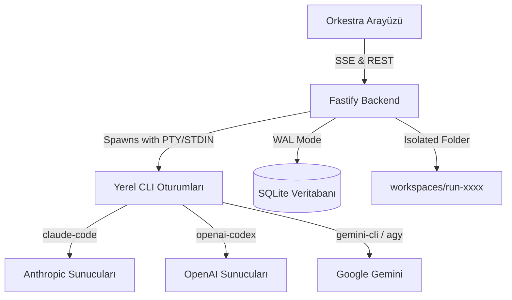

# 🎹 Orkestra

[](LICENSE)
[](https://nodejs.org/)
[](https://www.typescriptlang.org/)
[](https://fastify.dev/)
[](https://react.dev/)
[](https://vitejs.dev/)
[](https://sqlite.org/)

**Orkestra**, bilgisayarınızda zaten kurulu ve oturum açmış olan yerel yapay zeka CLI araçlarını (`claude-code`, `codex` ve `gemini-cli`/`agy`) tek bir modern panel üzerinden yöneten ve birbirleriyle haberleşen **yerel-öncelikli (local-first) bir Yapay Zeka Ajan Stüdyosudur.**

Herhangi bir harici API anahtarına veya ek ücretlere ihtiyaç duymadan, bilgisayarınızda açık olan CLI oturumlarını güvenli bir şekilde yönetir, çıktılarını yakalar ve bunları koordineli bir yazılım ekibi (`Planner → Builder → Reviewer → Fixer`) olarak koşturur.

---

## 📑 İçindekiler
- [✨ Öne Çıkan Özellikler](#-öne-çıkan-özellikler)
- [📸 Arayüz Görselleri](#-arayüz-görselleri)
- [⚙️ Nasıl Çalışır?](#-nasıl-çalışır)
- [🚀 Kurulum ve Başlangıç](#-kurulum-ve-başlangıç)
- [🛠️ Ortam Değişkenleri (.env)](#%EF%B8%8F-ortam-değişkenleri-env)
- [🧩 Ajan Komut Yapısı (Çalışan Parametreler)](#-ajan-komut-yapısı-çalışan-parametreler)
- [📡 API Uç Noktaları](#-api-uç-noktaları)
- [📂 Proje Dosya Yapısı](#-proje-dosya-yapısı)
- [⚖️ Lisans](#%EF%B8%8F-lisans)

---

## ✨ Öne Çıkan Özellikler

- **🤖 Çoklu Ajan ve Tartışma (Debate Modu):** Claude, Codex ve Gemini modellerini tek bir chat üzerinde toplayın. Katılımcıları hem CLI hem model bazında seçebilir, aynı CLI'nin farklı modellerini (örn. Gemini 3.5 Flash vs Gemini 3.1 Pro) birbiriyle tartıştırabilirsiniz.
- **🎯 Operatör Analiz Modu:** Çoklu ajan tartışmalarını bir "Operatör" modele yönlendirerek tartışmayı 5 yapılandırılmış başlıkta (Ortak Görüş, Ayrışan Noktalar, Kısmi Uzlaşı, Benzersiz Fikirler, Kör Noktalar) özetletin ve bu analize dayanarak tek tıkla kodlama planını başlatın.
- **💻 Sürekli Proje Geliştirme (Code Modu):** Workspace dizini kalıcıdır. Bir görevi bitirdikten sonra yeni prompt'larla aynı workspace üzerinde kodlamaya devam edebilirsiniz.
- **⚡ Ekip ve Görev Orkestrasyonu:** Büyük projeleri bağımsız alt görevlere (tasks) bölerek paralel (`Promise.all`) ve bağımlı görevleri sıralı olarak izole klasörlerde koşturur.
- **🔄 Otomatik Limit ve Hata Devri (Fallback):** Ajanların kotalarını anlık izler. Çalışma esnasında bir ajanın limiti biterse veya hata verirse, görevi yedek ajan listesindeki ilk uygun ajana otomatik devreder.
- **🚦 Müdahale ve Durdurma (Steering & Stop):** Ajanlar kod yazarken araya not bırakabilir, sıradaki ajana gidecek talimatları güncelleyebilir veya tek tıkla tüm süreci güvenle durdurabilirsiniz.
- **📊 Canlı Limit & Durum Takip Paneli:** Anthropic OAuth ve ChatGPT/Codex `wham/usage` API'lerinden canlı kullanım kotalarını çeker. Kotası biten modelleri arayüzde otomatik devre dışı bırakır.
- **🎙️ Sesli Giriş & Ekran Görüntüsü Desteği:** Web Speech API ile sesle dikte edebilir, panoya kopyaladığınız ekran görüntülerini (`Ctrl+V`) ajana doğrudan iletebilirsiniz.
- **🔒 Güvenli Git Yayıncısı:** Ajanların yazdığı kodları gözden geçirir, şifre/env gibi hassas dosyaları filtreler, commit'ler ve onayınızla Draft PR açar.

---

## 📸 Arayüz Görselleri

### 1. Sohbet ve Tartışma Alanı (Chat & Debate)
Modelleri yan yana tartıştırabildiğiniz, model limitlerini canlı olarak izleyebildiğiniz ve sesli dikte yapabildiğiniz ana stüdyo ekranı:


### 2. Geliştirici Çalışma Alanı (Code Workspace)
Sol tarafta ajan rollerinin komut tanımları, ortada run/görev süreçleri, sağ tarafta ise izole workspace dosya gezgininin yer aldığı üç kolonlu kodlama stüdyosu:


### 3. Ajan Yönetimi ve Canlı Limit Kontrolü
Bilgisayarınızdaki CLI'ların (Claude Code, OpenAI Codex, Antigravity) oturum durumlarını test edebildiğiniz ve 5 saatlik / haftalık kalan limitlerinizi canlı izlediğiniz Ajan Merkezi:


---

## ⚙️ Nasıl Çalışır?



1. **Planlama & Tartışma:** Ajanlar fikir alışverişinde bulunur ve nihai bir çözüm üzerinde uzlaşır.
2. **Görev Dağıtımı (Briefing):** Plancı ajan görevi alt parçalara ve dosya hedeflerine böler.
3. **Ekip Kodlama:** Ajanlar izole dizinlerde çalışarak `index.html`, `styles.css` gibi dosyaları fiziksel olarak üretir.
4. **Git Yayını:** Onayınızla güvenli bir şekilde commit & PR açılır.

---

## 🚀 Kurulum ve Başlangıç

### Ön Gereksinimler
Sisteminizde [Node.js](https://nodejs.org/) (versiyon 20+) yüklü olmalı ve entegre etmek istediğiniz CLI araçlarında oturum açılmış olmalıdır:

| CLI | Kurulum Komutu | Oturum Açma Komutu |
| --- | --- | --- |
| **Claude Code** | `npm install -g @anthropic-ai/claude-code` | `claude auth login` |
| **OpenAI Codex** | `npm install -g @openai/codex` | `codex login` |
| **Gemini / Antigravity** | `npm install -g @google/gemini-cli` (veya `agy` binary) | `agy login` |

### Projeyi Çalıştırma

1. Repoyu klonlayın ve klasöre girin:
   ```bash
   git clone https://github.com/burakdemir16/Orkestra-CLI.git
   cd Orkestra-CLI
   ```
2. Bağımlılıkları yükleyin:
   ```bash
   npm install
   ```
3. Geliştirici sunucusunu başlatın (Fastify backend ve Vite frontend eşzamanlı çalışacaktır):
   ```bash
   npm run dev
   ```

* **Frontend Panel:** [http://127.0.0.1:5173](http://127.0.0.1:5173)
* **Backend API:** [http://127.0.0.1:8787](http://127.0.0.1:8787)

---

## 🛠️ Ortam Değişkenleri (.env)

Proje kök dizinindeki `.env` dosyasından aşağıdaki ayarları değiştirebilirsiniz:

```env
ORKESTRA_HOST=127.0.0.1
ORKESTRA_PORT=8787
ORKESTRA_DATA_DIR=data
ORKESTRA_WORKSPACE_DIR=workspaces
```

---

## 🧩 Ajan Komut Yapısı (Çalışan Parametreler)

Ajanlar çalışırken etkileşimli onay ekranlarına takılmamak ve dosyaları doğru dizinlere yazabilmek için aşağıdaki parametre şablonlarını kullanırlar. Promptlar, CLI argüman sınırlarına takılmaması için **STDIN** üzerinden ajanlara tünellenir.

* **Antigravity Ajanları (Builder & Reviewer):**
  - **Komut:** `agy`
  - **Argümanlar:** `["-p", "--dangerously-skip-permissions"]`
* **Claude Ajanı (Fixer & Debate):**
  - **Komut:** `claude`
  - **Argümanlar:** `["-p", "--permission-mode", "acceptEdits"]`
* **OpenAI Codex Ajanı (Planner):**
  - **Komut:** `codex`
  - **Argümanlar:** `["exec", "--dangerously-bypass-approvals-and-sandbox"]`

---

## 📡 API Uç Noktaları

Backend, `127.0.0.1:8787` portu üzerinde çalışır:

- `GET /api/health` -> Sistem ve veritabanı sağlık durumu.
- `GET /api/cli-status` -> Canlı CLI yetkilendirme ve kalan kota pencereleri.
- `POST /api/chat` -> Çoklu/Tekli chat başlatma.
- `POST /api/runs` -> Görev çalıştırma (ekip modu).
- `GET /api/runs/:id/events` -> Çalışma adımlarının ve loglarının anlık SSE akışı.
- `POST /api/runs/:id/note` -> Çalışan ajana ara yönlendirme (steering) ekleme.
- `POST /api/runs/:id/stop` -> Aktif çalışmayı durdurma.

---

## 📂 Proje Dosya Yapısı

```text
├── apps/
│   ├── server/             # Fastify Backend
│   │   └── src/
│   │       ├── index.ts    # REST API & SSE Akış Sunucusu
│   │       ├── cli.ts      # Ajan STDIN yönetimi ve entegrasyonu
│   │       ├── usage.ts    # Canlı kota & limit sorgulayıcı (OAuth/Wham)
│   │       ├── runner.ts   # Görev ve ekip orkestratörü
│   │       └── git.ts      # Güvenli Git yayıncısı
│   └── web/                # React + Vite Arayüzü (Cam efekti / Glassmorphism)
├── packages/
│   └── shared/             # Ortak TypeScript tip tanımları
├── docs/                   # Ekran görüntüleri ve mimari şemalar
├── data/                   # SQLite Veritabanı (WAL modunda)
└── workspaces/             # Ajanların kod yazdığı izole çalışma klasörleri
```

---

## ⚖️ Lisans

Bu proje **PolyForm Noncommercial License 1.0.0** lisansı altında dağıtılmaktadır. Kişisel ve ticari olmayan amaçlarla serbestçe kullanabilir, değiştirebilir ve paylaşabilirsiniz. Detaylar için [`LICENSE`](LICENSE) dosyasına göz atabilirsiniz.
