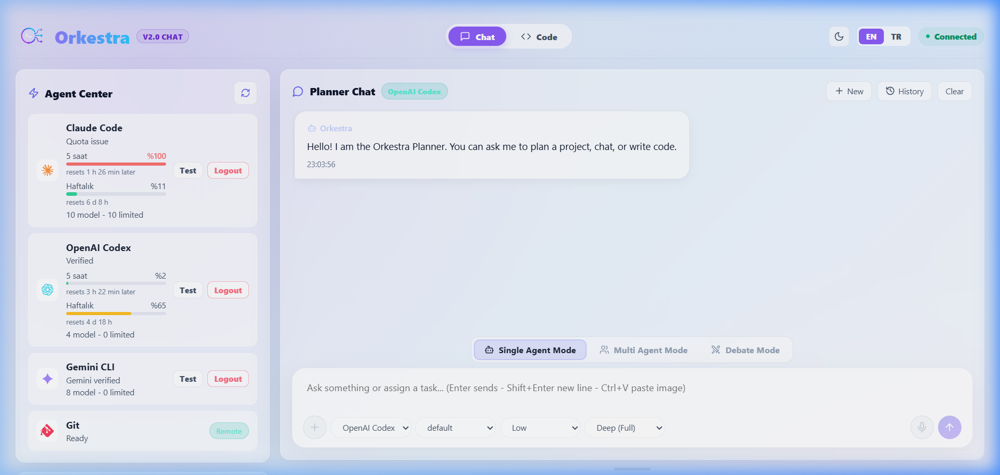
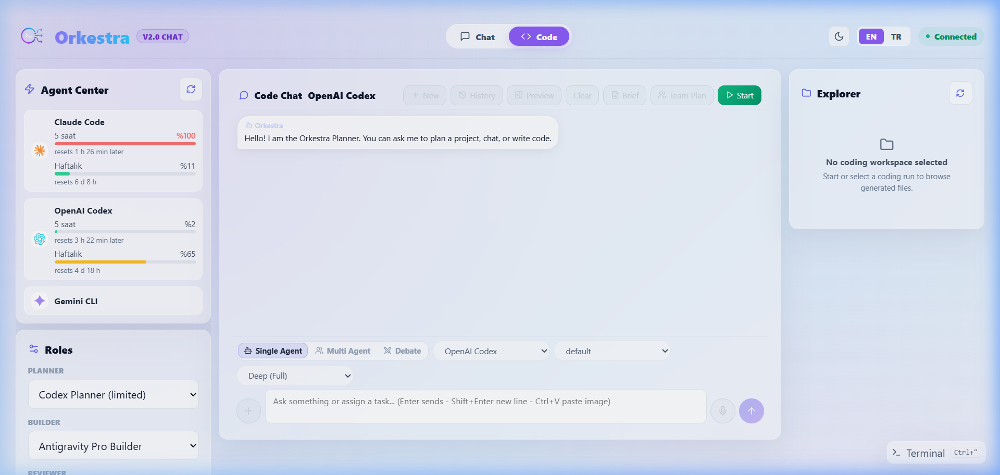
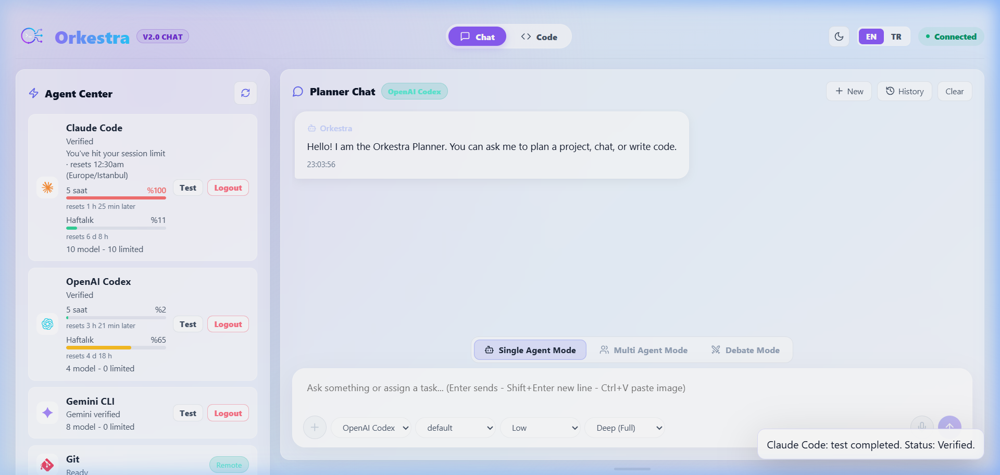
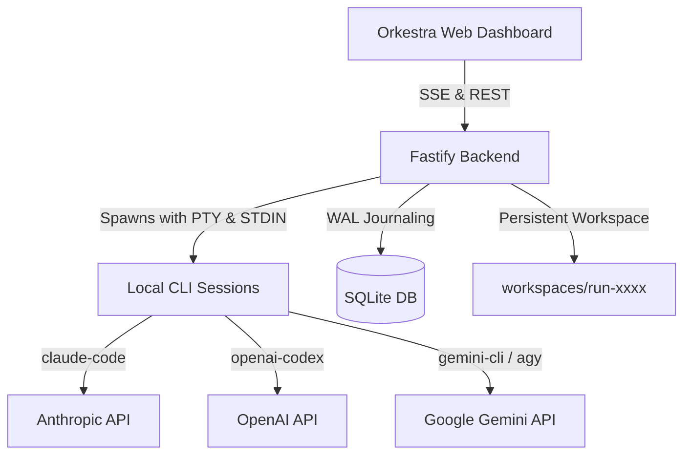

# 🎹 Orkestra

[](LICENSE)
[](https://nodejs.org/)
[](https://www.typescriptlang.org/)
[](https://fastify.dev/)
[](https://react.dev/)
[](https://vitejs.dev/)
[](https://sqlite.org/)

**Orkestra** is a premium, **local-first AI Agent Studio** that orchestrates the AI CLIs you already have installed and logged in on your machine — `claude-code`, `codex`, and `gemini-cli` / `agy` (Antigravity) — into a single unified developer panel.

Instead of paying for third-party API proxies or direct token costs, Orkestra runs as a secure local daemon. It drives your existing CLI sessions directly on your loopback address (`127.0.0.1`), pipes their stdout/stderr stream in real-time, extracts files, tracks live usage limits, and coordinates them as a collaborative software engineering department.

---

## 📑 Table of Contents
- [📸 Screenshots](#-screenshots)
- [🎮 Core Collaboration Modes](#-core-collaboration-modes)
- [⚡ Key Development Phases (Phase 1 - 6)](#-key-development-phases-phase-1---6)
- [⚙️ How It Works](#%EF%B8%8F-how-it-works)
- [🚀 Getting Started](#-getting-started)
- [🔧 Configuration (.env)](#-configuration-env)
- [🧩 Agent Command Mappings (Headless Parameters)](#-agent-command-mappings-headless-parameters)
- [🔌 API Endpoints](#-api-endpoints)
- [📦 Project Structure](#-project-structure)
- [⚖️ License](#%EF%B8%8F-license)

---

## 📸 Screenshots

### 1. Chat & Debate Studio
Brainstorm, debate in parallel across different CLIs and models, and review live token quotas.


### 2. Multi-Agent Code Workspace
The three-column code editor: review agent CLI settings on the left, watch tasks run step-by-step in the center, and explore files inside the persistent workspace on the right.


### 3. Agent Center & Live Limits
Verify your local CLI authentications and view live usage limits (5-hour and weekly windows) fetched directly from Anthropic and OpenAI token history.


---

## 🎮 Core Collaboration Modes

Orkestra operates in three distinct cognitive layouts depending on the complexity of your task:

### 1. Single Agent Mode (Tekli Ajan Modu)
Directs your task to a single designated agent (e.g., Claude Code, Codex, or Antigravity). This is the fastest layout, ideal for straightforward modifications, scripting, styling, or direct code edits where a singular model's context is sufficient.

### 2. Multi Agent Mode (Çoklu Ajan Modu)
Sends the task to multiple selected agents in parallel. Each agent works on the prompt independently inside its own context. Orkestra aggregates their replies and displays them side-by-side. This mode is excellent for comparison tests, parallel implementation options, or code translation across languages.

### 3. Debate Mode (Tartışma Modu)
Enables multiple models to engage in a multi-turn conversation where they can see and critique each other's replies. For example, Claude and Gemini can debate the database architecture of a new feature. They iteratively review each other's plans to find flaws, build a consensus, and finalize a highly optimized implementation plan before any code is written.

---

## ⚡ Key Development Phases (Phase 1 - 6)

Orkestra is built around six critical, integrated capabilities that elevate it from a simple wrapper to a complete software team orchestrator:

### 🔄 Phase 1: Continuous Project (Sürekli Proje)
Unlike standard pipelines that clean up the working directory after a run, Orkestra's **Workspace is persistent**. When you enter a follow-up prompt, the agents continue working in the same directory (`workspaces/run-xxxx`). They inspect the existing files, refactor them, and add new features incrementally, allowing you to develop complex applications step-by-step.

### 👥 Phase 2: Multi-Participant / Model Picker (Çoklu Katılımcı/Model Tartışması)
Participants are defined as a `{ CLI, Model }` tuple. You are not locked into one model per CLI. You can add multiple models from the same CLI (e.g., running `Gemini 3.5 Flash` alongside `Gemini 3.1 Pro` through `agy`) as separate participants in a debate or parallel execution run, letting you mix and match reasoning vs. speed strengths.

### 🚦 Phase 3: Steered Runs & Interruption (Araya Müdahale/Durdurma)
You don't have to wait blindly for a long pipeline to finish.
- **Steering:** While the pipeline is active, you can drop notes into the queue. As soon as the current agent step finishes, Orkestra injects your note as a "User Interruption Instruction" into the next agent's prompt.
- **Stop:** Click the header's red **Dur (Stop)** button to immediately kill the active CLI process and pause the execution safely.

### 📐 Phase 4: Team & Task Dependency Orchestration (Ekip & Görev Orkestrasyonu)
When starting a team run, the Planner agent analyzes the codebase and outputs a dependency graph of sub-tasks (e.g., `task_1` writes models, `task_2` writes server routes, `task_3` designs index page). 
- Orkestra groups these tasks and spawns them **in parallel** (`Promise.all`) if they don't depend on each other.
- Dependent tasks wait and run sequentially.
- Each task runs in its own sub-folder to ensure clean isolation, preventing agents from conflicting during simultaneous file modifications.

### ⛓️ Phase 5: Quota & Error Fallback Chain (Kota/Hata Fallback Devri)
CLI tools are prone to rate limits (429) or token exhaustion. Orkestra reads CLI output streams in real-time. If it detects a quota error (`quota_limit_reached`, `rate_limit`, or command failures), it automatically consults the agent's defined **Fallback Chain**. The task is handed over to the next candidate agent in line. Because the workspace is shared, the fallback agent seamlessly resumes the work where the previous one was cut off.

### 🎯 Phase 6: Operator Analysis Mode (Operatör Analiz Modu)
In Debate Mode, you can assign a model as the **Operator**. Once the participants finish their debate turns, the Operator reviews the entire discussion log and builds a structured 5-part summary:
1. **Shared Views (Ortak Görüş):** Points where all models agree.
2. **Disagreements (Ayrıştığı Noktalar):** Conflicting architectural decisions.
3. **Partial Consensus (Kısmi Uzlaşı):** Points supported by at least two models.
4. **Unique Ideas (Benzersiz Fikirler):** Creative standouts proposed by a single model.
5. **Blind Spots (Kör Noktalar):** Leftovers or issues missed by the models, contributed directly by the Operator.
The user reviews this analysis and clicks **"Bu analize göre kodla" (Code based on analysis)** to automatically convert it into a task graph and initiate the team run.

---

## ⚙️ How It Works



1. **Ideation (Chat/Debate):** A user submits a prompt. Planners debate and align on code layout.
2. **Analysis (Operator):** The Operator creates a structured plan from the debate.
3. **Execution (Team Run):** The backend resolves task dependencies and executes commands in the persistent workspace.
4. **Publishing (Git):** Files are audited, and the user approves Git commits and PR creations.

---

## 🚀 Getting Started

### Prerequisites
Install [Node.js](https://nodejs.org/) (v20 or higher) and the CLI tools you wish to orchestrate. Make sure each CLI is fully authenticated and logged in locally:

| CLI | Install Command | Login Command |
| --- | --- | --- |
| **Claude Code** | `npm install -g @anthropic-ai/claude-code` | `claude auth login` |
| **OpenAI Codex** | `npm install -g @openai/codex` | `codex login` |
| **Antigravity / Gemini** | `npm install -g @google/gemini-cli` (or `agy` binary) | `agy login` |

### Quick Start

1. Clone the repository and navigate inside:
   ```bash
   git clone https://github.com/burakdemir16/Orkestra-CLI.git
   cd Orkestra-CLI
   ```
2. Install npm dependencies:
   ```bash
   npm install
   ```
3. Start the development server (runs Vite web app and Fastify backend concurrently):
   ```bash
   npm run dev
   ```

- **Frontend Interface:** [http://127.0.0.1:5173](http://127.0.0.1:5173)
- **Backend API:** [http://127.0.0.1:8787](http://127.0.0.1:8787)

---

## 🔧 Configuration (.env)

Customize your directories and ports inside `.env` in the root folder:

```env
ORKESTRA_HOST=127.0.0.1
ORKESTRA_PORT=8787
ORKESTRA_DATA_DIR=data
ORKESTRA_WORKSPACE_DIR=workspaces
```

---

## 🧩 Agent Command Mappings (Headless Parameters)

To run CLI tools smoothly in headless mode without hitting visual confirmation locks or security prompts, Orkestra pipes prompts via **STDIN** and passes safety bypass arguments:

* **Antigravity Ajanları (Builder & Reviewer):**
  - **Command:** `agy`
  - **Arguments:** `["-p", "--dangerously-skip-permissions"]`
* **Claude Ajanı (Fixer & Debate):**
  - **Command:** `claude`
  - **Arguments:** `["-p", "--permission-mode", "acceptEdits"]`
* **OpenAI Codex Ajanı (Planner):**
  - **Command:** `codex`
  - **Arguments:** `["exec", "--dangerously-bypass-approvals-and-sandbox"]`

*At runtime, the runner injects the active shell PATH (e.g. `AppData\Local\agy\bin` or npm paths) so CLI executables are resolved correctly.*

---

## 📡 API Endpoints

The Fastify server exposes a REST API at `127.0.0.1:8787`:

- `GET /api/health` -> System and database status.
- `GET /api/cli-status` -> Active CLI authentication info, dynamic models, and usage limits.
- `POST /api/chat` -> Triggers Single/Multi/Debate chat prompts.
- `POST /api/runs` -> Spawns task-based team runs.
- `GET /api/runs/:id/events` -> SSE stream of run steps, logs, and files.
- `POST /api/runs/:id/note` -> Enqueues user notes/instructions for active runs.
- `POST /api/runs/:id/stop` -> Immediately cancels the active runner process.

---

## 📦 Project Structure

```text
├── apps/
│   ├── server/             # Fastify Backend
│   │   └── src/
│   │       ├── index.ts    # Fastify server & REST endpoints
│   │       ├── cli.ts      # Spawn controllers & STDIN piping
│   │       ├── usage.ts    # Anthropic/OpenAI quota web-scrapers & cache
│   │       ├── runner.ts   # Dependency graphs & parallel task execution
│   │       └── git.ts      # Git Publisher & file security review
│   └── web/                # React + Vite Glassmorphism Frontend
├── packages/
│   └── shared/             # Shared TypeScript types
├── docs/                   # Visual assets and screenshots
├── data/                   # SQLite database (WAL) & uploads
└── workspaces/             # Persistent workspace directories
```

---

## ⚖️ License

Distributed under the **PolyForm Noncommercial License 1.0.0**. You may copy, modify, and distribute this software for **non-commercial** purposes only. See [`LICENSE`](LICENSE) for complete terms.
