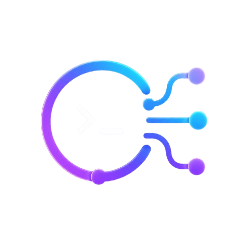
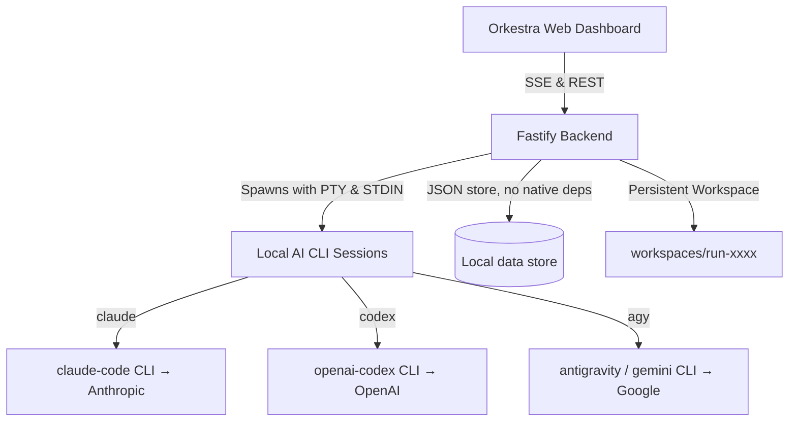

<p align="center">
  
</p>

<h1 align="center">Orkestra</h1>

[](https://www.npmjs.com/package/orkestra-cli)
[](LICENSE)
[](https://nodejs.org/)
[](https://www.typescriptlang.org/)
[](https://fastify.dev/)
[](https://react.dev/)
[](https://vitejs.dev/)
[](#-getting-started)

**Orkestra** is a premium, **local-first AI Agent Studio** that orchestrates the AI CLIs you already have installed and logged in on your machine — `claude-code`, `codex`, and `gemini-cli` / `agy` (Antigravity) — into a single unified developer panel.

Instead of paying for third-party API proxies or direct token costs, Orkestra runs as a secure local daemon. It drives your existing CLI sessions directly on your loopback address (`127.0.0.1`), pipes their stdout/stderr stream in real-time, extracts files, tracks live usage limits, and coordinates them as a collaborative software engineering department.

Around that orchestration core, Orkestra ships a full **IDE-like cockpit**: a **file explorer** with **open-in-VS-Code**, a **live diff/file reviewer**, an **integrated terminal** (PowerShell/cmd), an **in-app browser preview** (auto-detects React/Vite and static sites), **voice input** (microphone dictation), **live usage/limit tracking** per CLI, desktop **notifications**, **document export** (Markdown/PDF/Word/Excel) in Chat mode, and **native GitHub integration** — connect via OAuth Device Flow and create/push/clone repos with an **embedded Git** that works even on machines without Git installed.

---


## 📑 Table of Contents
- [📸 Screenshots](#-screenshots)
- [🎮 Core Collaboration Modes](#-core-collaboration-modes)
- [⚡ Key Development Phases (Phase 1 - 6)](#-key-development-phases-phase-1---6)
- [🔗 Native GitHub Integration](#-native-github-integration)
- [🛠️ Workspace Tooling](#%EF%B8%8F-workspace-tooling)
- [💸 Cost & Efficiency](#-cost--efficiency)
- [⚙️ How It Works](#%EF%B8%8F-how-it-works)
- [🚀 Getting Started](#-getting-started)
- [🔧 Configuration (.env)](#-configuration-env)
- [🧩 Agent Command Mappings (Headless Parameters)](#-agent-command-mappings-headless-parameters)
- [🔌 API Endpoints](#-api-endpoints)
- [📦 Project Structure](#-project-structure)
- [🔒 Privacy & Security](#-privacy--security)
- [⚖️ License](#%EF%B8%8F-license)

---

## 📸 Screenshots

### 1. Chat & Debate Studio
Brainstorm, debate in parallel across different CLIs and models, and review live token quotas.


### 2. Multi-Agent Code Workspace
The three-column code editor: review agent CLI settings on the left, watch tasks run step-by-step in the center, and explore files inside the persistent workspace on the right.


### 3. Agent Center & Live Limits
Verify your local CLI authentications and view live usage limits (5-hour and weekly windows) fetched directly from Anthropic and OpenAI token history.


---

## 🎮 Core Collaboration Modes

Orkestra operates in three distinct cognitive layouts depending on the complexity of your task:

### 1. Single Agent Mode (Tekli Ajan Modu)
Directs your task to a single designated agent (e.g., Claude Code, Codex, or Antigravity). This is the fastest layout, ideal for straightforward modifications, scripting, styling, or direct code edits where a singular model's context is sufficient.

### 2. Multi Agent Mode (Çoklu Ajan Modu)
Sends the task to multiple selected agents in parallel. Each agent works on the prompt independently inside its own context. Orkestra aggregates their replies and displays them side-by-side. This mode is excellent for comparison tests, parallel implementation options, or code translation across languages.

### 3. Debate Mode (Tartışma Modu)
Enables multiple models to engage in a multi-turn conversation where they can see and critique each other's replies. For example, Claude and Gemini can debate the database architecture of a new feature. They iteratively review each other's plans to find flaws, build a consensus, and finalize a highly optimized implementation plan before any code is written.

---

## ⚡ Key Development Phases (Phase 1 - 6)

Orkestra is built around six critical, integrated capabilities that elevate it from a simple wrapper to a complete software team orchestrator:

### 🔄 Phase 1: Continuous Project (Sürekli Proje)
Unlike standard pipelines that clean up the working directory after a run, Orkestra's **Workspace is persistent**. When you enter a follow-up prompt, the agents continue working in the same directory (`workspaces/run-xxxx`). They inspect the existing files, refactor them, and add new features incrementally, allowing you to develop complex applications step-by-step.

### 👥 Phase 2: Multi-Participant / Model Picker (Çoklu Katılımcı/Model Tartışması)
Participants are defined as a `{ CLI, Model }` tuple. You are not locked into one model per CLI. You can add multiple models from the same CLI (e.g., running `Gemini 3.5 Flash` alongside `Gemini 3.1 Pro` through `agy`) as separate participants in a debate or parallel execution run, letting you mix and match reasoning vs. speed strengths.

### 🚦 Phase 3: Steered Runs & Interruption (Araya Müdahale/Durdurma)
You don't have to wait blindly for a long pipeline to finish.
- **Steering:** While the pipeline is active, you can drop notes into the queue. As soon as the current agent step finishes, Orkestra injects your note as a "User Interruption Instruction" into the next agent's prompt.
- **Stop:** Click the header's red **Dur (Stop)** button to immediately kill the active CLI process and pause the execution safely.

### 📐 Phase 4: Team & Task Dependency Orchestration (Ekip & Görev Orkestrasyonu)
When starting a team run, the Planner agent analyzes the codebase and outputs a dependency graph of sub-tasks (e.g., `task_1` writes models, `task_2` writes server routes, `task_3` designs index page). 
- Orkestra groups these tasks and spawns them **in parallel** (`Promise.all`) if they don't depend on each other.
- Dependent tasks wait and run sequentially.
- Each task runs in its own sub-folder to ensure clean isolation, preventing agents from conflicting during simultaneous file modifications.

### ⛓️ Phase 5: Quota & Error Fallback Chain (Kota/Hata Fallback Devri)
CLI tools are prone to rate limits (429) or token exhaustion. Orkestra reads CLI output streams in real-time. If it detects a quota error (`quota_limit_reached`, `rate_limit`, or command failures), it automatically consults the agent's defined **Fallback Chain**. The task is handed over to the next candidate agent in line. Because the workspace is shared, the fallback agent seamlessly resumes the work where the previous one was cut off.

### 🎯 Phase 6: Operator Analysis Mode (Operatör Analiz Modu)
In Debate Mode, you can assign a model as the **Operator**. Once the participants finish their debate turns, the Operator reviews the entire discussion log and builds a structured 5-part summary:
1. **Shared Views (Ortak Görüş):** Points where all models agree.
2. **Disagreements (Ayrıştığı Noktalar):** Conflicting architectural decisions.
3. **Partial Consensus (Kısmi Uzlaşı):** Points supported by at least two models.
4. **Unique Ideas (Benzersiz Fikirler):** Creative standouts proposed by a single model.
5. **Blind Spots (Kör Noktalar):** Leftovers or issues missed by the models, contributed directly by the Operator.
The user reviews this analysis and clicks **"Bu analize göre kodla" (Code based on analysis)** to automatically convert it into a task graph and initiate the team run.

---

## 🔗 Native GitHub Integration

Orkestra talks to GitHub **without depending on the `gh` CLI**, so publishing works on any machine — including ones where the user distributes the app and Git isn't even installed.

- **Embedded Git (`dugite`):** Git is **bundled** with the app. All version-control operations (init, baseline, diff, clone, push) run through the embedded binary, so a system Git install is optional. Each project workspace is its own isolated repository (a `.gitignore` and per-project `git init` keep it from leaking into a parent repo).
- **One-click connect (OAuth Device Flow):** From the composer **`+` → GitHub → "Connect with GitHub"**, a browser opens GitHub's device page; you approve and you're in. Authentication uses a public OAuth App **Client ID** baked into the app, so **end users never create or paste tokens**. A Personal Access Token flow is available as an advanced fallback.
- **Create / Push / Clone:**
  - **Push** a project to a brand-new repo, or paste an existing repo URL to push to it.
  - Once linked, Orkestra **remembers the repo** and offers a one-click **"Push update"** — no re-asking.
  - **Clone** a GitHub repo straight into a new project.
- **Agents can push too:** when connected, the embedded Git in agent processes is authenticated via an **ephemeral HTTP header**, so a coding agent can run `git push` on request. The token is **never written to `.git/config` or disk** in plain text — it is stored encrypted with **Windows DPAPI**.
- **Pull requests** are opened directly through the GitHub REST API.

> Reachable from three places: the composer **`+` menu**, each project's **⋯ menu**, and the **diff/review panel** ("GitHub'a gönder"). All of them detect whether the project is already linked and push directly if so.

---

## 🛠️ Workspace Tooling

Orkestra isn't just a chat box — it's a full **IDE-like cockpit** in the browser:

- **🗂️ File explorer** — browse the active project's tree (or any local folder you open). Click a file to read it in a built-in viewer with **Copy** and **Open in VS Code** buttons.
- **🔍 File / diff review** — a Claude-Code-style review bar appears at the bottom on **every change, every phase** (not just at the end). Open the side panel for per-file unified diffs — **cumulative across all turns**, heavy/generated folders (`node_modules`, `dist`, …) excluded, cached + pre-warmed so it opens instantly.
- **💻 Integrated terminal** — real PowerShell / cmd tabs (`node-pty` + `@xterm/xterm`) right next to your work.
- **🌐 In-app browser preview** — auto-detects React/Vite and static projects, runs the dev server, and renders the live app inside Orkestra.
- **🧩 Open in VS Code** — jump from any file or the whole project straight into VS Code.
- **🎙️ Voice input** — dictate prompts with your microphone (speech-to-text) instead of typing.
- **📊 Live usage / limit tracking** — see each CLI's 5-hour and weekly quota usage in real time, so you know how much headroom you have before switching.
- **🔔 Desktop notifications** — get pinged when an answer finishes, a phase awaits approval, coding completes, or an error occurs (Service-Worker based, with action buttons).
- **📄 Document export (Chat mode)** — turn a conversation's output into **Markdown, PDF, Word, Excel, or TXT** with preview cards, then download — no coding required.
- **🔁 Chat → Code bridge** — promote a planning conversation into a structured Code Task Brief and jump straight into the coding stage, carrying the plan and operator analysis with you.
- **📂 Open existing / clone** — add any local folder as a project, or clone a GitHub repo, in addition to creating fresh workspaces.

---

## 💸 Cost & Efficiency

Orkestra is built to be **cheaper than metered APIs** by driving the **flat-rate CLI subscriptions** you already pay for. The structural truth: **API billing grows with every token and has no ceiling; a subscription is flat and capped.**

For the same heavy coding month (**≈46M tokens** = 39.6M in + 6.6M out), at public list prices:

| Provider | Metered API (this workload) | Flat CLI subscription |
|---|---:|---|
| Claude | ≈ **$218/mo** (Sonnet) · ≈ $1,089/mo (Opus) | $20 (Pro) → $100–200 (Max) |
| OpenAI | ≈ **$165/mo** | $20 (Plus) → $200 (Pro) |
| Gemini | ≈ **$116/mo** | $20 (AI Pro) → ~$250 (Ultra) |

Each price above is **per provider** and flat. Note Claude Code requires a paid plan (Pro $20, with lower limits; Max $100–200 for heavy use); Codex is on ChatGPT Plus ($20); Gemini/Antigravity has a free tier. So running **all three together** means stacking entry plans — realistically **≈$40–60/mo** at the low end, up to a few hundred at the heaviest tiers. That is still flat and capped, versus the **$116–$1,089** the same month bills on metered APIs — and the more you code, the wider the gap. Orkestra's **multi-CLI + fallback chain** pools these subscriptions' quotas so heavy workloads run at flat cost.

And you can often go **below** that floor. A single subscription is already enough to get value: **Antigravity alone bundles several frontier models** under a genuinely generous free tier, and Orkestra runs them as **multiple agents that share one workspace and stay aware of each other**, with an operator model synthesizing their work — **no extra API key, no per-token spend**. So multi-agent, operator-style collaboration is reachable even from one (often free) plan; stacking paid plans on top only widens the gap versus metered APIs.

📊 **Full methodology, formula, sources and caveats → [docs/COST.md](docs/COST.md)** (every number is public and reproducible).

---

## ⚙️ How It Works



> **Orkestra only drives the local CLIs.** It never calls Anthropic/OpenAI/Google APIs directly and never sees your model keys — each CLI manages its own authentication and provider calls. Orkestra spawns the CLI, pipes the prompt over STDIN, and streams the output back.

1. **Ideation (Chat/Debate):** A user submits a prompt. Planners debate and align on code layout.
2. **Analysis (Operator):** The Operator creates a structured plan from the debate.
3. **Execution (Team Run):** The backend resolves task dependencies and executes commands in the persistent workspace.
4. **Review (Diff):** Changed files stream live; the cumulative diff is reviewable at any time, and a preview/terminal sit alongside.
5. **Publishing (GitHub):** Files are audited; the user connects GitHub once (Device Flow) and pushes, clones, or opens PRs through the embedded Git + REST API.

---

## 🚀 Getting Started

### Prerequisites
Install [Node.js](https://nodejs.org/) (v20 or higher). You do **not** need to install the AI CLIs by hand — **Orkestra's first-run setup wizard installs and logs you into them for you** (Claude Code, OpenAI Codex, Antigravity/Gemini) with one click. The commands below are only a manual reference/fallback:

| CLI | Manual install (optional — wizard does this) | Login |
| --- | --- | --- |
| **Claude Code** | `npm install -g @anthropic-ai/claude-code` | `claude auth login` |
| **OpenAI Codex** | `npm install -g @openai/codex` | `codex login` |
| **Antigravity / Gemini** | `npm install -g @google/gemini-cli` (or `agy` binary) | `agy login` |

> Git is **not** required either — it is bundled (`dugite`).

### Install (one line)

```bash
npm install -g orkestra-cli
orkestra
```

The `orkestra` command starts the local server (serving the built UI) and opens it in your browser at **http://127.0.0.1:8787**. Data and project workspaces are stored under `~/.orkestra`. The setup wizard then walks you through installing/authenticating the CLIs. (Running `orkestra` again while it's already up just reopens the browser.)

> **No compiler needed.** Orkestra installs on any Node 20+ machine without Python or build tools — storage is a dependency-free JSON store and Git is bundled (`dugite`). The integrated terminal uses an optional native module (`node-pty`); if it can't be built on a given machine, the terminal is simply disabled and everything else works.

> **Publishing to npm** (maintainer): the bare name `orkestra` is already taken on npm, so the package is named **`orkestra-cli`** (the binary stays `orkestra`). To publish: `npm login` then `npm publish`. After that, anyone can run `npm install -g orkestra-cli`.

### Run from source (development)

```bash
git clone https://github.com/burakdemir16/Orkestra-CLI.git
cd Orkestra-CLI
npm install
npm run dev      # Vite web app + Fastify backend concurrently
```

- **Frontend (dev):** [http://127.0.0.1:5173](http://127.0.0.1:5173)
- **Backend API:** [http://127.0.0.1:8787](http://127.0.0.1:8787)

---

## 🔧 Configuration (.env)

Customize your directories and ports inside `.env` in the root folder:

```env
ORKESTRA_HOST=127.0.0.1
ORKESTRA_PORT=8787
ORKESTRA_DATA_DIR=data
ORKESTRA_WORKSPACE_DIR=workspaces
ORKESTRA_WEB_DIST=dist/web
# Per-agent run timeout in seconds (default 1800 = 30 min)
ORKESTRA_AGENT_TIMEOUT_SECONDS=1800
```

> 💡 **Performance tip:** keep `ORKESTRA_WORKSPACE_DIR` **outside a cloud-synced folder** (e.g. OneDrive). Cloud sync makes Git operations on large workspaces noticeably slower.

`ORKESTRA_WEB_DIST` is optional. It lets packaged launchers point the Fastify server at a bundled web build even when their working directory is not the repository root.

---

## 🧩 Agent Command Mappings (Headless Parameters)

To run CLI tools smoothly in headless mode without hitting visual confirmation locks or security prompts, Orkestra pipes prompts via **STDIN** and passes safety bypass arguments:

* **Antigravity Ajanları (Builder & Reviewer):**
  - **Command:** `agy`
  - **Arguments:** `["-p", "--dangerously-skip-permissions"]`
* **Claude Ajanı (Fixer & Debate):**
  - **Command:** `claude`
  - **Arguments:** `["-p", "--permission-mode", "acceptEdits"]`
* **OpenAI Codex Ajanı (Planner):**
  - **Command:** `codex`
  - **Arguments:** `["exec", "--dangerously-bypass-approvals-and-sandbox"]`

*At runtime, the runner injects the active shell PATH (e.g. `AppData\Local\agy\bin` or npm paths) so CLI executables are resolved correctly.*

---

## 📡 API Endpoints

The Fastify server exposes a REST API at `127.0.0.1:8787`:

**Core**
- `GET /api/health` -> System and database status.
- `GET /api/cli-status` -> Active CLI authentication info, dynamic models, and usage limits.
- `POST /api/chat` -> Triggers Single/Multi/Debate chat prompts.
- `POST /api/runs` -> Spawns task-based team runs.
- `GET /api/runs/:id/events` -> SSE stream of run steps, logs, and files.
- `POST /api/runs/:id/note` -> Enqueues user notes/instructions for active runs.
- `POST /api/runs/:id/stop` -> Immediately cancels the active runner process.

**Projects & files**
- `POST /api/projects/create` · `POST /api/projects/open` · `POST /api/projects/rename` -> Create, open a local folder, or rename a project.
- `GET /api/files` · `POST /api/open-folder` · `POST /api/open-in-vscode` -> Explore files, reveal in OS file manager, open in VS Code.

**Diff & review**
- `GET /api/git/diff/:runId` -> A single run's working-tree diff.
- `POST /api/git/diff` -> The project's **cumulative** diff across all turns (excludes heavy dirs).
- `POST /api/git/changes` -> Fast change count (drives the review bar's visibility).

**GitHub (no `gh` CLI)**
- `GET /api/github/status` · `POST /api/github/connect` · `POST /api/github/disconnect` -> Connection state & PAT connect.
- `POST /api/github/device/start` · `POST /api/github/device/poll` -> OAuth Device Flow.
- `POST /api/github/repo` · `POST /api/github/push` · `POST /api/github/clone` · `POST /api/github/remote` -> Create repo, push, clone, read linked origin.
- `POST /api/git/pr` -> Open a pull request via the REST API.

**Live preview**
- `GET /api/preview/info/:runId` · `POST /api/preview/start` · `GET /api/preview/status` · `POST /api/preview/stop` -> Detect, run, and control the in-app dev-server preview.

---

## 📦 Project Structure

```text
├── apps/
│   ├── server/             # Fastify Backend
│   │   └── src/
│   │       ├── index.ts    # Fastify server & REST endpoints (chat, runs, git, github, preview)
│   │       ├── cli.ts      # CLI detection, chat/plan/debate, STDIN piping
│   │       ├── usage.ts    # Anthropic/OpenAI quota web-scrapers & cache
│   │       ├── runner.ts   # Dependency graphs & parallel task execution
│   │       ├── git.ts      # Embedded Git (dugite): diff, baseline, clone, push
│   │       ├── github.ts   # GitHub REST + OAuth Device Flow + encrypted token store
│   │       ├── preview.ts  # Live dev-server preview manager
│   │       ├── events.ts   # SSE event hub
│   │       └── db.ts       # dependency-free JSON store (no native build)
│   └── web/                # React + Vite Glassmorphism Frontend (single-page studio)
├── packages/
│   └── shared/             # Shared TypeScript types
├── docs/                   # Visual assets and screenshots
├── data/                   # JSON store, uploads & encrypted tokens
└── workspaces/             # Persistent, per-project Git workspaces
```

---

## 🔒 Privacy & Security

- **Local-first:** everything runs on `127.0.0.1`; your code and conversations never leave your machine.
- **No model keys handled by Orkestra:** it drives the CLIs you have already installed and authenticated — it never asks for Anthropic/OpenAI/Google API keys.
- **GitHub tokens** are stored **encrypted with Windows DPAPI** (never in plain text) and are **never persisted into any repo's `.git/config`**; agent pushes authenticate via an ephemeral header held only in process memory.
- **Secret hygiene:** secret-looking files (`.env`, `*token*`, `*secret*`, `*credential*`, private keys) are excluded from diffs and commits; heavy/generated folders (`node_modules`, `dist`, …) are ignored.

---

## 🤝 Contributing

Contributions are welcome — issues, ideas, and PRs. See [`CONTRIBUTING.md`](CONTRIBUTING.md) for setup, project layout, the PR checklist, and good first issues.

---

## ⚖️ License

Distributed under the **Apache License 2.0**. You may use, modify, and distribute this software — including for commercial purposes — provided you retain the license and notices. See [`LICENSE`](LICENSE) for complete terms.
