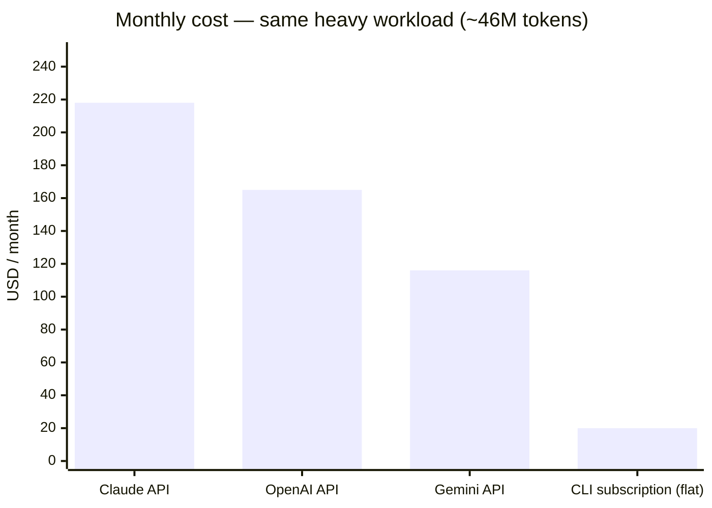

# Cost & Efficiency — API vs CLI

Orkestra is designed to be **cost-efficient**: instead of paying metered, per-token **API** prices, it drives the **flat-rate CLI subscriptions** you already have (Claude Code, OpenAI Codex, Antigravity/Gemini). This page shows the difference with transparent, reproducible numbers.

> **The irrefutable core (true regardless of exact prices):**
> **API billing is metered and grows with usage — there is no upper bound.**
> **A subscription is flat: your bill never exceeds the tier price, no matter how much you use it (within fair-use quota).**

---

## The workload (held constant)

A representative **heavy coding month**:

- ~1,320 coding tasks/month (≈60/workday)
- ~30k input + 5k output tokens per task (coding agents resend file context, so input dominates)
- **≈ 46M tokens/month** → 39.6M input + 6.6M output

## The formula (recompute it yourself)

```
Monthly API cost = input(M) × ($ / 1M input) + output(M) × ($ / 1M output)
```

## Public list prices (per 1M tokens, early 2026 — verify at the official pages)

| Provider | API model | Input | Output | This workload (46M) |
|---|---|---:|---:|---:|
| Claude | Sonnet | $3 | $15 | **≈ $218 / mo** |
| Claude | Opus | $15 | $75 | **≈ $1,089 / mo** |
| OpenAI | GPT-class | $2.50 | $10 | **≈ $165 / mo** |
| Gemini | 2.5 Pro | $1.25 | $10 | **≈ $116 / mo** |

| Provider | Flat CLI subscription (per month) |
|---|---|
| Claude | Pro **$20** · Max $100–200 |
| OpenAI | Plus **$20** · Pro $200 |
| Gemini | AI Pro **$20** · Ultra ~$250 |

**Sources (verifiable):** `anthropic.com/pricing`, `openai.com/api/pricing` + `chatgpt.com/pricing`, `ai.google.dev/pricing` + `gemini.google/subscriptions`.

## Same workload, side by side



Those subscription prices are **per provider**, not the total for all three. To genuinely run **all three** you stack plans: at the entry tier that is **≈$40–60/mo** (two $20 plans + Gemini's free tier), rising to a few hundred a month if every provider sits on its heaviest tier. Either way it stays **flat and capped**, while the same month bills **$116–$1,089** on a metered API. And because API cost scales linearly with usage while a subscription is flat, **the more you code, the wider the gap** — there is a breakeven point (≈4M tokens/mo vs a $20 plan at a blended ~$5/1M) beyond which the API is always more expensive, and heavy coding is far past it.

## Honest caveats (so the comparison stands up)

- Subscriptions have **fair-use quotas**; a $20 tier may not sustain the heaviest months, so a higher flat tier ($100–250) may be needed. **It is still flat, predictable, and below flagship API cost** for the same work.
- API gives no rate ceiling but you pay for every token; subscriptions trade a quota for a fixed price.
- **This is where Orkestra helps most:** it combines **multiple subscriptions + a fallback chain**, pooling quotas so heavy workloads run at flat cost — no per-token metering. When one CLI hits its limit, the next picks up where it left off.

## Verify it yourself

1. Use Orkestra (or your CLIs) for a normal week and read your real token usage from each CLI's usage panel.
2. Multiply by the official per-token prices above.
3. Compare to your flat subscription fee. The gap is your saving.

*Prices change — the table is dated early 2026. Always confirm current numbers on the official pricing pages; the structural conclusion (metered vs flat) does not change.*
